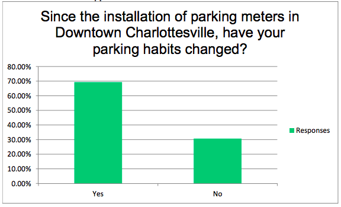
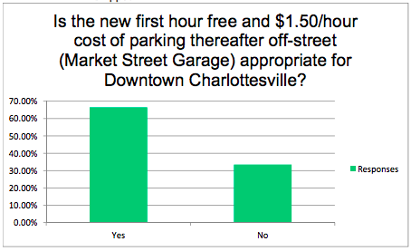
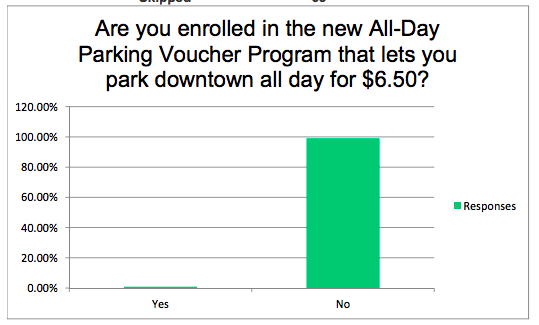

```{r setup, include=FALSE, warning = F, message = F}
knitr::opts_chunk$set(echo = FALSE, comment = "", fig.height = 4)
library(geojsonio)
library(spdep)
library(leaflet)
library(lubridate)
library(viridis)
library(ggsci)
library(magrittr)
library(tidyverse)
```

## Did it work {.build}


- How do you quanitfy success?
    - Revenue
    - Vacancy (units?)
    - Online surveys
    
- Finish the planned experiment
    - [City council minutes 2018-01-02](http://www.charlottesville.org/home/showdocument?id=60199)

- What does the data say?

## Community survey 2017-11-28

[Full document](http://www.charlottesville.org/home/showdocument?id=59713)



## Are the garage prices good?


## Are businesses supporting their employees?




## Program trends

```{r data_indump}
# for some reason markdown is timing out ???

# dat <- geojson_read("https://opendata.arcgis.com/datasets/d68e620e74e74ec1bd0184971e82ffaa_15.geojson",
#                     parse = TRUE)
# saveRDS(dat, "in.RDS")

dat <- readRDS("in.RDS") # work around


dat %<>% .[["features"]] %>% .[[2]]

names(dat) %<>% tolower()

dat$date <- as.POSIXct(dat$date_payment, format = "%Y/%m/%d")

tmp <- strsplit(dat$parkingendtime, " ") # split column into date, clock:time, AM/PM parts

dat$time <- map_chr(tmp, ~.[2]) %>% # get clock:time from each 2nd slot
    as.POSIXct(format = "%H:%M:%S")

pm_add <- ifelse(grepl("PM", dat$parkingendtime) & !grepl(" 12:", dat$time), #
                 43200,
                 0)

dat$time %<>% add(pm_add)

dat %<>% filter(transactiontype != "Collect. Card")

dat$week <- isoweek(dat$date) %>% as.factor()
dat$day <- wday(dat$date, T)
dat %<>% filter(day != "Sun")
dat$hour <- hour(dat$time)

week_rev <- group_by(dat, week, day) %>%
    summarise(rev = sum(total))

ggplot(week_rev, aes(week, rev, fill = day)) +
    geom_col()
```

- First and last weeks are partial
- No decline over the program

## Weekly patterns

```{r weekly}
rev_by_day <- group_by(dat, day) %>% 
    summarise(revenue = sum(total))

ggplot(rev_by_day, aes(day, revenue, fill = day)) +
    geom_col()
```

- Steady increase to peak on Saturday
- Pattern likely mirrors businees revenue

## Daily patterns

```{r, fig.height = 4}
group_by(dat, hour, day) %>%
    summarise(rev = sum(total)) %>%
    ggplot(aes(hour, rev, colour = day, group = day)) +
    geom_path(size = 1.5) +
    scale_color_d3() +
    scale_x_continuous(breaks = c(8,12,17,20), labels = c("8a", "12p", "5p", "8p"))
```

- Spikes everyday at lunch & dinner
- A lot more lunch outings on Friday
- Is that a Monday happy hour peak?

## 💵 Talks

Average paid meter fee:

```{r}
mean(dat$total) %>% round(2)
```

Total meter revenue: 

```{r}
sum(dat$total)
```

Estimated yearly revenue:
```{r}
week_rev <- group_by(dat, week) %>%
    summarise(rev = sum(total)) %>%
    slice(c(-1, -n()))

mean(week_rev$rev) * 52
```

## Spatial distribution

```{r meter_revenue}
space_rev <- group_by(dat, spacename, metertype, meter_lat, meter_long) %>%
    summarise(revenue = sum(total))

pal <- colorNumeric(
    palette = "viridis",
    domain = log2(space_rev$revenue))

leaflet(space_rev) %>%
    addProviderTiles("OpenStreetMap.BlackAndWhite") %>%
    addCircleMarkers(lat= ~meter_lat, lng= ~meter_long,
                     color = ~pal(log2(revenue)),
                     radius = ~ifelse(metertype == "Singlespace", 10, 20)) %>%
    addLegend("bottomright", pal = pal, values = ~log2(revenue),
              labFormat = labelFormat(transform = function(x) 2^x),
              title = "$USD Revenue")
```

- Multispot bias

## Normalized to average spaces

- Average 5.6 spaces per multimeter

```{r averge_space}
# table(space_rev$metertype)
avg_spaces <- (105 - 28) / 13

space_rev %<>% mutate(avg_space_revnue = ifelse(metertype == "Singlespace",
                                                 revenue,
                                                 revenue / avg_spaces))
pal <- colorNumeric(
    palette = "viridis",
    domain = space_rev$avg_space_revnue)

leaflet(space_rev) %>%
    addProviderTiles("OpenStreetMap.BlackAndWhite") %>%
    addCircleMarkers(lat= ~meter_lat, lng= ~meter_long,
                     color = ~pal(avg_space_revnue),
                     radius = ~ifelse(metertype == "Singlespace", 10, 20)) %>%
    addLegend("bottomright", pal = pal, values = ~avg_space_revnue,
              title = "$USD Revenue") %>%
    widgetframe::frameWidget(height = '400')
```

- Balanced usage
- Good design

## But what about occupancy?

- Hard to define
- Comparing apples to mystery fruit
    - Previous data/reports aren't public
- Computationally intensive
    - Hours of calculations

## Average occupancy per hour

```{r occ_graph, warning = F, message = F}
dfl <- readRDS("dfl.RDS")

dfl %>% group_by(spacename, hour) %>%
    summarise(pct_occ = sum(occ_bool) / n()) %>%
    ggplot(aes(hour, spacename, fill = pct_occ)) +
    geom_tile() +
    scale_fill_viridis() +
    scale_x_continuous(breaks = c(8,12,17), labels(c("8:30a", "12:30p", "5:30p"))) +
    labs(y = NULL, x = NULL,
         fill = "% Occupied")
```


## Here we are today

- City estimates they will take a loss due to secondary costs (vandalism, consultant)

- Why did they cancel early?
    - On track for profit
    - Meters already paid for
    - What report did they see?


## Future

- Raise on-street prices

- Better anlysis requires more data
    - Business revenues (same period)
    - Parking garage usage/revenues
    - Total cost (consultants, maintanence, repair)
    - Tickets written (same period)
    
- Call for open data
    - Make all government data/reports available
    - Public input should be data driven not emotional
    - Best if data is available real-time
        - So the community can see it first hand
    - Hire data pros to help
    
## Questions


